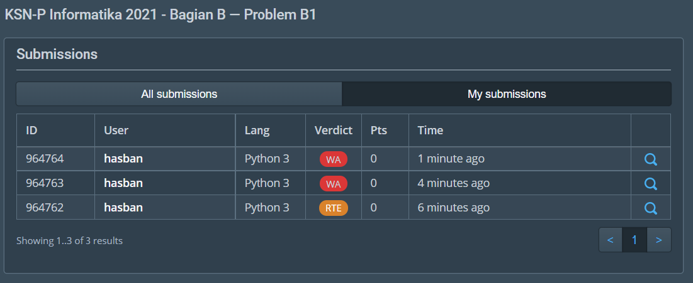

## SOAL KSN-P 2021 Informatika 2021 - Bagian B — Problem B1

<h2 class="programming-problem-statement__name">Buah</h2><table class="bp4-html-table bp4-html-table-condensed programming-problem-statement__limits"><tbody><tr><td>Time limit</td><td>1 s</td></tr><tr><td>Memory limit</td><td>64 MB</td></tr></tbody></table>

<h3>Deskripsi</h3>

Untuk menjaga kesehatannya, Pak Dengklek membeli buah-buahan untuk dimakan. Pak Dengklek membeli <math xmlns="http://www.w3.org/1998/Math/MathML"><semantics><mrow><mi>N</mi></mrow><annotation encoding="application/x-tex">N</annotation></semantics></math>N buah apel merah dan <math xmlns="http://www.w3.org/1998/Math/MathML"><semantics><mrow><mi>N</mi></mrow><annotation encoding="application/x-tex">N</annotation></semantics></math>N buah apel hijau. Semua apel merah mempunyai berat masing-masing sebesar <math xmlns="http://www.w3.org/1998/Math/MathML"><semantics><mrow><mi>A</mi></mrow><annotation encoding="application/x-tex">A</annotation></semantics></math>A dan semua apel hijau mempunyai berat masing-masing sebesar <math xmlns="http://www.w3.org/1998/Math/MathML"><semantics><mrow><mi>B</mi></mrow><annotation encoding="application/x-tex">B</annotation></semantics></math>B. Kemudian, Pak Dengklek ingin memakan sebagian buah apel merah dan apel hijau. Namun, Pak Dengklek ingin mengambil sesedikit mungkin apel sedemikian sehingga total berat apel yang diambil untuk masing-masing warna harus sama, dan minimal harus mengambil satu dari masing-masing jenis apel.

<h3>Format Masukan</h3>

Baris pertama berisi bilangan-bilangan <math xmlns="http://www.w3.org/1998/Math/MathML"><semantics><mrow><mi>N</mi></mrow><annotation encoding="application/x-tex">N</annotation></semantics></math>N, <math xmlns="http://www.w3.org/1998/Math/MathML"><semantics><mrow><mi>A</mi></mrow><annotation encoding="application/x-tex">A</annotation></semantics></math>A, dan <math xmlns="http://www.w3.org/1998/Math/MathML"><semantics><mrow><mi>B</mi></mrow><annotation encoding="application/x-tex">B</annotation></semantics></math>B yang menyatakan banyak apel untuk masing-masing warna, berat setiap apel merah, dan berat setiap apel hijau.&nbsp;

<h3>Format Keluaran</h3>

Sebuah baris berisi sebuah bilangan bulat yang berisi banyak apel minimal&nbsp;sesuai dengan deskripsi cerita di atas.

<h3>Contoh Masukan</h3>

<pre>5 2 3</pre>

<h3>Contoh Keluaran</h3>

<pre>5</pre>

<h3>Penjelasan Contoh</h3>

Pada contoh pertama, Pak Dengklek mengambil <math xmlns="http://www.w3.org/1998/Math/MathML"><semantics><mrow><mn>3</mn></mrow><annotation encoding="application/x-tex">3</annotation></semantics></math>3 apel merah dan <math xmlns="http://www.w3.org/1998/Math/MathML"><semantics><mrow><mn>2</mn></mrow><annotation encoding="application/x-tex">2</annotation></semantics></math>2 apel hijau, sehingga total berat masing-masing warna sama yaitu <math xmlns="http://www.w3.org/1998/Math/MathML"><semantics><mrow><mn>6</mn></mrow><annotation encoding="application/x-tex">6</annotation></semantics></math>6.

<h3>Subsoal</h3>

<h4>Subsoal 1 (50 poin)</h4>

<ul>
	<li><math xmlns="http://www.w3.org/1998/Math/MathML"><semantics><mrow><mn>1</mn><mo>≤</mo><mi>N</mi><mo>≤</mo><mn>1000</mn></mrow><annotation encoding="application/x-tex">1 \leq N \leq 1000</annotation></semantics></math>1≤N≤1000</li>
	<li><math xmlns="http://www.w3.org/1998/Math/MathML"><semantics><mrow><mn>1</mn><mo>≤</mo><mi>A</mi><mo separator="true">,</mo><mi>B</mi><mo>≤</mo><mi>N</mi></mrow><annotation encoding="application/x-tex">1 \leq A, B \leq N</annotation></semantics></math>1≤A,B≤N</li>
	<li><math xmlns="http://www.w3.org/1998/Math/MathML"><semantics><mrow><mi>A</mi></mrow><annotation encoding="application/x-tex">A</annotation></semantics></math>A dan <math xmlns="http://www.w3.org/1998/Math/MathML"><semantics><mrow><mi>B</mi></mrow><annotation encoding="application/x-tex">B</annotation></semantics></math>B relatif prima (<math xmlns="http://www.w3.org/1998/Math/MathML"><semantics><mrow><mi>F</mi><mi>P</mi><mi>B</mi><mo stretchy="false">(</mo><mi>A</mi><mo separator="true">,</mo><mi>B</mi><mo stretchy="false">)</mo><mo>=</mo><mn>1</mn></mrow><annotation encoding="application/x-tex">FPB(A, B) = 1</annotation></semantics></math>FPB(A,B)=1)</li>
</ul>

<h4>Subsoal 2 (50 poin)</h4>

<ul>
	<li><math xmlns="http://www.w3.org/1998/Math/MathML"><semantics><mrow><mn>1</mn><mo>≤</mo><mi>N</mi><mo>≤</mo><mn>1</mn><msup><mn>0</mn><mn>5</mn></msup></mrow><annotation encoding="application/x-tex">1 \leq N \leq 10^5</annotation></semantics></math>1≤N≤105</li>
	<li><math xmlns="http://www.w3.org/1998/Math/MathML"><semantics><mrow><mn>1</mn><mo>≤</mo><mi>A</mi><mo separator="true">,</mo><mi>B</mi><mo>≤</mo><mi>N</mi></mrow><annotation encoding="application/x-tex">1 \leq A, B \leq N</annotation></semantics></math>1≤A,B≤N</li>
</ul>

## My Result

kalau mau lihat langsung di websitenya silahkan kunjungi
link berikut ini
[https://tlx.toki.id/profiles/hasban/submission-history](https://tlx.toki.id/profiles/hasban/submission-history) 