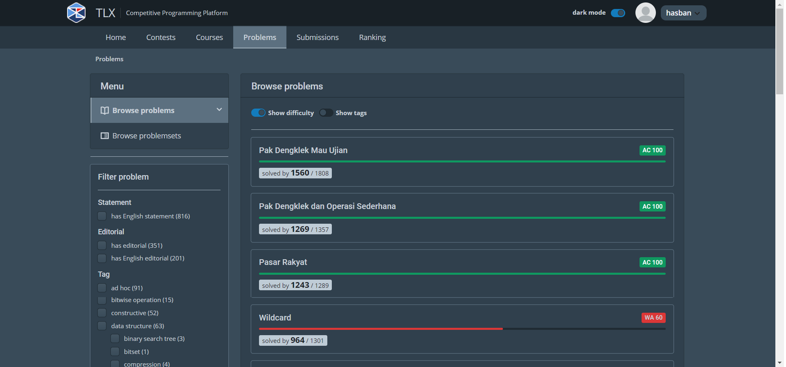

## TLX TOKI PROBLEM

## DESKRIPSI

### Apa itu TLX Toki?
diinisiasi oleh Ikatan Alumni Tim Olimpiade Komputer Indonesia (IA TOKI), TLX Training Gate merupakan proyek e-learning untuk belajar pemrograman kompetitif yang ditujukan bagi pelajar Indonesia.

### Bahasa pemrogramman apa yang di pake?
* kalau untuk course saat ini hanya tersedia [PASCAL](https://id.wikipedia.org/wiki/Pascal_(bahasa_pemrograman)) dan [C++](https://id.wikipedia.org/wiki/C%2B%2B)
* untuk problem solving bisa menggunakan bahasa [C](https://id.wikipedia.org/wiki/C_(bahasa_pemrograman)), [C++11](https://en.wikipedia.org/wiki/C%2B%2B11), [C++17](https://en.wikipedia.org/wiki/C%2B%2B17), [GO](https://www.enigmacamp.com/golang-bahasa-pemrograman-backend-yang-sedang-populer-saat-ini/#:~:text=Golang%20adalah%20bahasa%20pemrograman%20open%20source%20yang%20dikembangkan%20oleh%20tim%20Google.&text=Bahasa%20pemrograman%20ini%20tentunya%20dapat,website%2C%20mobile%2C%20dan%20lainnya.), [JAVA 8](https://id.wikipedia.org/wiki/Java), [PASCAL](https://id.wikipedia.org/wiki/Pascal_(bahasa_pemrograman)), [python 3](https://id.wikipedia.org/wiki/Python_(bahasa_pemrograman)), dan [pypy 3](https://id.wikipedia.org/wiki/PyPy#:~:text=PyPy%20adalah%20interpreter%20bahasa%20pemrograman,menjaga%20kompatibilitas%20dengan%20interpreter%20CPython.)
* untuk website [tlx](https://tlx.toki.id/) sendiri dibuat menggunakan bahasa [Tex](https://id.wikipedia.org/wiki/LaTeX#:~:text=LaTeX%20adalah%20bahasa%20markup%20atau,dokumen%2C%20atau%20membuat%20formula%20matematika.&text=Memiliki%20format%20dokumen%20yang%20terstruktur,terlihat%20sangat%20profesional%20dan%20sempurna.) dan [C++](https://id.wikipedia.org/wiki/C%2B%2B). jika ingin melihat langsung source codenya anda bisa langsung mengunjungi githubnya [di sini](https://github.com/ia-toki/training-gate-id)

### Di repository ini bakal di isi tentang apa?
dokumentasi problem problem yang sudah saya selesaikan

## History Submission
jika anda ingin melihat history submission saya silahkan klik link [ini](https://tlx.toki.id/profiles/hasban/submission-history)  

